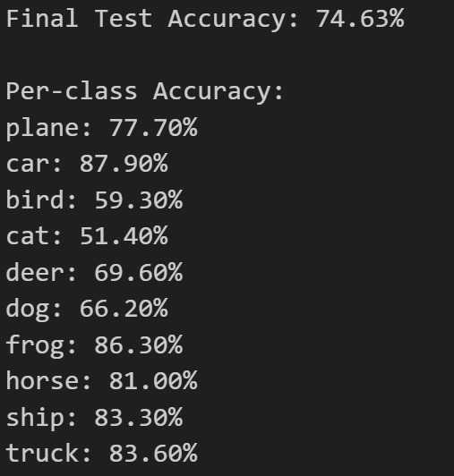

# Image Classifier: CIFAR-10 Dataset Analysis

Systematic comparison of CNN architectures and transfer learning on the CIFAR-10 dataset.

TLDR: This program implements a comprehensive comparison of four deep learning models for image classification on the CIFAR-10 dataset using PyTorch. It systematically evaluates two different approaches: a custom CNN architecture (TinyVGG) trained from scratch versus a pre-trained ResNet18 using transfer learning. Each approach is tested both with and without data augmentation techniques. The program demonstrates the dramatic impact of transfer learning, achieving 74.6% accuracy with a custom CNN versus 94.7% with pre-trained ResNet18. It includes complete training pipelines, evaluation metrics, confusion matrices, and visualization plots, providing insights into modern deep learning techniques for computer vision tasks.

---

## About the Dataset:

One of the most widely used benchmark datasets in machine learning and computer vision. Created by Alex Krizhevsky in 2009, it serves as a standard evaluation tool for image classification algorithms. 
### Dataset Specifications

- **Total Images**: 60,000 color images
- **Image Size**: 32×32 pixels (3 RGB channels)  
- **Classes**: 10 categories (airplane, automobile, bird, cat, deer, dog, frog, horse, ship, truck)
- **Distribution**: 6,000 images per class
- **Split**: 50,000 training images + 10,000 test images

## CNN Architecture: 

This TinyVGG implementation is a simplified CNN designed for CIFAR-10 classification, inspired by the VGG architecture.
1. The first block takes the 32×32 RGB image and applies two convolution layers with 64 filters to detect edges and shapes. ReLU makes values non-negative, adding non-linearity. A MaxPool then halves the size to 16×16, keeping key features and discarding redundancy.
2. The second block increases the number of feature maps from 64 to 128, allowing for the learning of more complex patterns. Using the same conv-ReLU-conv-ReLU-pool setup, it reduces the size to 8×8 while deepening the features for higher-level understanding.
3. The classifier flattens the 8×8×128 maps into 8,192 values, then passes them through fully connected layers. Dropout randomly disables half the connections to avoid overfitting and improve generalization. A dense layer reduces features to 512, and the final layer outputs 10 class predictions for CIFAR-10.

## Loss function and Optimizer used: 

- The loss function uses CrossEntropyLoss, which measures how far the model's predictions are from the correct answers by comparing probability distributions. This is specifically designed for multi-class classification problems.
- The optimizer uses Stochastic Gradient Descent (SGD) with a 0.001 learning rate and 0.9 momentum. SGD updates model weights using gradients, while momentum smooths updates like a moving average, helping avoid local minima. Together, they ensure stable and effective training.

## Training and Testing Phase:

An **epoch** is one complete pass of the entire training dataset through the model.

1. The train_loop handles one training epoch by iterating over batches, resetting gradients, running forward and backward passes, updating weights, and logging accuracy every 500 mini-batches.
2. The test_loop complements it by running one evaluation epoch on unseen data without updates. Using torch.no_grad() for efficiency, it computes loss and accuracy to gauge generalization.
3. Finally, the train_model ties both together across multiple epochs, alternating training and testing, adjusting learning rates, and recording metrics, returning the full training history for analysis.

## Final Evaluation Phase:

The evaluate_model function assesses model performance beyond overall accuracy. In evaluation mode with gradients off, it first computes test accuracy across all batches while storing predictions and true labels for a confusion matrix. A second pass performs per-class analysis, showing strengths and weaknesses across the 10 CIFAR-10 categories, and returns labels and metrics for detailed visualization.

## Data Visualization:
- Training & Validation Loss Curves: Line plots showing loss decrease over epochs for all 4 models
- Training & Validation Accuracy Curves: Line plots tracking accuracy improvement over epochs
- Confusion Matrices: Heatmaps using seaborn showing prediction accuracy for each of the 10 CIFAR-10 classes
- Classification Reports: Text-based per-class precision, recall, and F1-score summaries

## Visual Metrics:

### Training CNN without augmentation:

*Final accuracy and class-wise metrics*

